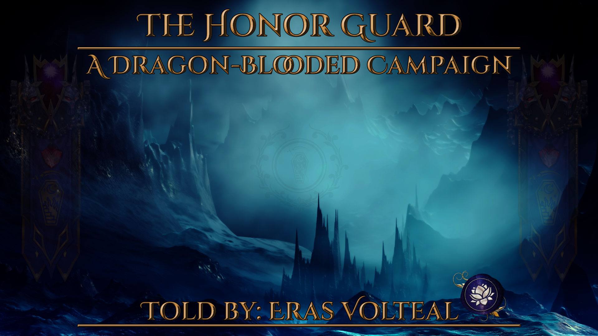

+++
title = "Honor Guard Campaign"
date = "2025-05-22T03:06:22+02:00"
author = "Angela Ridder"
authorTwitter = "VoltealCodeGoat"
cover = "honor-guard-cover-1.jpg"
tags = ["ttrpgs", "exalted-3e", "dming"]
keywords = ["exalted-3e", "dming", "ttrpgs", ""]
description = "A post of me documenting my journey of planning a campaign following a group of young scions of the twelve Great Houses if the Realm who have been sent to the frozen north to serve as the Satrap's ceremonial Honor Guard. What could go wrong?"
showFullContent = false
readingTime = true
hideComments = true
draft = true
+++

## Introduction

Placeholder.

## Basic Information

**Game Title**: Honour Guard | A Dragon-Blooded Exalted 3e Campaign
**Game System**: Exalted 3rd Edition
**Game Hook**: A group of young scions of the twelve Great Houses have been sent to the frozen north to serve as the Satrap's ceremonial Honor Guard. What could go wrong?
**Game Themes**: Fantasy, High Fantasy, Mystery, Political Intrigue
**Game Description**: Nestled amidst in the northwest of creation, amidst a snow blanketed coast, lays the city of Fajad like a shining beacon of civilization in the frozen tundra. The city is a strangely temperate place, its harbor free of ice, snow melting as it touches the particolored domes of the prince’s palace and the Grand Mosque’s airy minarets. The alien warmth grows strongest at the city’s heart, where steaming hot springs gather at the base of the thousand-foot stony spire called the Needle.

A grand festival approaches, one that honors the founding ancestors who build the city from nothing with their blood, sweat, and lives. Everyone of note within the city will be attending, from the leaders of the merchants and artisans guilds and local nobility to monks of the immaculate order and representatives of the realm. Hushed rumors around the local populace even has it that the Scarlet Empress herself was invited!

At the behest of Fajad's Satrap, Cathak Mei, young scions of the twelve great houses have been sent to serve as her ceremonial Honor Guard.



## Character Creation

The characters in this campaign are young scions of the twelve Great Houses. They were hand-picked for this special assignment by their families. They are the most decorated or honored graduated of their class fresh out of secondary education. They will all be creating their character using the 'Just Hatched' rules in the Dragon-Blooded rulebook, with a few modifications, as listed below.

```
• Their Essence Rating is 1.
• The character has finished their secondary education, so receive 2 bonus specialties based on their background.
• They get twelve dots of Merits. (The Resources merit is capped to a maximum of **2 dots**)
• They choose ten Charms and five Excellencies. (for a total of 15)
• They can spend 15 Bonus points.

For this game the players can not take the following merits at character creation:
- Command
- Followers
- Influence
- Retainers
- Backing

These merits are bought during play or earned through the story.
```

## Homebrew Rules

Placeholder

##
